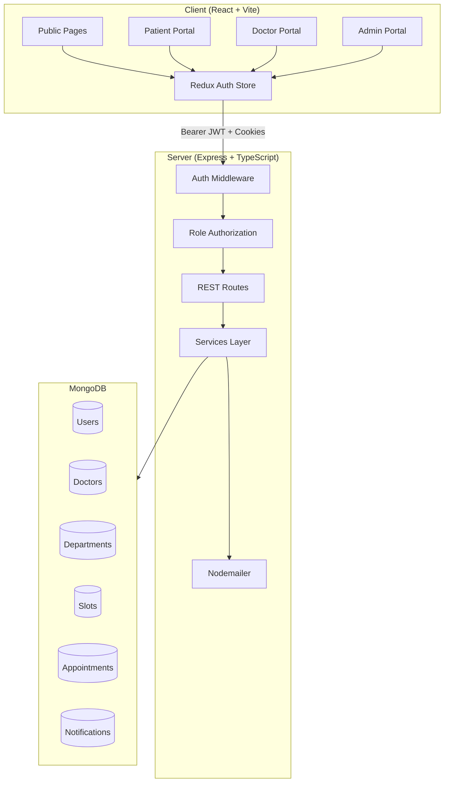

# Sahid Hospital Appointment System

> A full-stack web platform for citizens to book, view, reschedule, and cancel appointments at Sahid Hospital — with dedicated portals for patients, doctors, and administrators.


---

## Table of Contents

1. [Overview](#overview)
2. [Features](#features)
3. [Tech Stack](#tech-stack)
4. [System Architecture](#system-architecture)
5. [Database Schema / ER Diagram](#database-schema--er-diagram)
6. [Folder Structure](#folder-structure)
7. [Prerequisites](#prerequisites)
8. [Installation & Setup](#installation--setup)
9. [Running the Project](#running-the-project)
10. [Environment Variables Reference](#environment-variables-reference)
11. [API Documentation](#api-documentation)
12. [User Roles & Access](#user-roles--access)
13. [Screenshots](#screenshots)
14. [Testing](#testing)
15. [Deployment](#deployment)
16. [Known Limitations / Out of Scope](#known-limitations--out-of-scope)
17. [Future Enhancements](#future-enhancements)
18. [Contributing](#contributing)
19. [License](#license)
20. [Author / Contact](#author--contact)

---

## Overview

The **Sahid Hospital Appointment System** is an e-governance web application that digitizes outpatient appointment management for a single government hospital. Citizens (patients) can register online, browse departments and doctors, book time slots, and manage their appointments without visiting the hospital in person. Doctors manage their availability and patient queues; administrators oversee departments, staff, and hospital-wide reporting.

This project addresses long waiting times and manual booking inefficiencies by providing a secure, role-based platform with real-time slot availability, transactional booking (no double-booking), and email notifications.

---

## Features

### Patient
- Register and log in securely
- Multi-step booking flow: department → doctor → date/slot → confirm
- View, filter, reschedule, and cancel appointments (2-hour cutoff enforced)
- Profile management and notification history
- Browse public pages: departments, doctors, FAQ, contact

### Doctor
- Log in to a dedicated doctor portal
- Create and delete availability slots; view booked vs. available slots
- View assigned appointments with patient details
- Mark appointments as **completed** or **no-show**
- Update own profile (name, phone, specialization)

### Admin
- Dashboard with live statistics (patients, doctors, appointments, cancellation rate)
- CRUD for departments and doctor accounts
- View/search/cancel any appointment
- View registered patients
- Reports: appointments by day and department, cancellation rate
- Manage hospital announcements (static content in v1)

---

## Tech Stack

| Layer | Technology | Purpose |
|-------|------------|---------|
| **Frontend** | React 19 + Vite | Fast SPA with HMR |
| **Frontend** | TypeScript | Type-safe UI code |
| **Frontend** | Tailwind CSS 4 | Utility-first responsive styling |
| **Frontend** | React Router 7 | Client-side routing |
| **Frontend** | Redux Toolkit | Auth/session state management |
| **Frontend** | Axios | HTTP client with token refresh |
| **Frontend** | React Hook Form + Zod | Form validation |
| **Backend** | Node.js + Express | REST API server |
| **Backend** | TypeScript | Type-safe server code |
| **Database** | MongoDB + Mongoose | Document storage and ODM |
| **Auth** | JWT (access + refresh) | Stateless auth with httpOnly refresh cookie |
| **Security** | bcrypt (12 rounds) | Password hashing |
| **Validation** | express-validator | Server-side request validation |
| **Email** | Nodemailer | Booking/cancellation emails (Ethereal in dev) |
| **Dev Tools** | ESLint, Prettier, tsx | Linting, formatting, dev execution |

---

## System Architecture

The application follows a classic **3-tier architecture**:

1. **Presentation tier** — React SPA served by Vite (port 5173)
2. **Application tier** — Express REST API (port 5000) with JWT auth and RBAC
3. **Data tier** — MongoDB storing users, doctors, slots, appointments, and notifications



---

## Database Schema / ER Diagram

| Collection | Description |
|------------|-------------|
| **User** | Registered patients (`role: patient`) |
| **Doctor** | Hospital doctors with department, credentials, and active status |
| **Admin** | System administrators |
| **Department** | Medical departments (Cardiology, Pediatrics, etc.) |
| **Slot** | Doctor availability windows with `is_booked` flag |
| **Appointment** | Links patient + doctor + slot; unique `slot_id` prevents double booking |
| **Notification** | Email/SMS notification records tied to appointments |

```mermaid
erDiagram
    User ||--o{ Appointment : books
    Doctor ||--o{ Appointment : attends
    Doctor }o--|| Department : belongs_to
    Doctor ||--o{ Slot : has
    Slot ||--o| Appointment : reserved_by
    Appointment ||--o{ Notification : triggers
    Admin {
        ObjectId _id PK
        string full_name
        string email UK
        string password_hash
        string role
    }
    User {
        ObjectId _id PK
        string full_name
        string email UK
        string phone
        string password_hash
        string role
        date created_at
    }
    Doctor {
        ObjectId _id PK
        string full_name
        ObjectId department_id FK
        string email UK
        string password_hash
        boolean is_active
        string role
    }
    Department {
        ObjectId _id PK
        string name UK
        string description
    }
    Slot {
        ObjectId _id PK
        ObjectId doctor_id FK
        date slot_date
        string start_time
        string end_time
        boolean is_booked
    }
    Appointment {
        ObjectId _id PK
        ObjectId patient_id FK
        ObjectId doctor_id FK
        ObjectId slot_id FK_UK
        string status
        string reason
        date booked_at
    }
    Notification {
        ObjectId _id PK
        ObjectId appointment_id FK
        string type
        string message
        boolean is_sent
        date sent_at
    }
```

**Indexes:** unique on `email` fields; compound `(doctor_id, slot_date)` on slots; compound `(doctor_id, slot_date, start_time)` unique on slots; unique on `appointment.slot_id`.

**Concurrency:** Appointment booking uses MongoDB transactions to atomically set `slot.is_booked = true` and create the appointment.

---

## Folder Structure

```
sahid-hospital/
├── client/                          # React frontend (Vite + TypeScript)
│   ├── src/
│   │   ├── components/              # Layouts, ProtectedRoute, UI primitives
│   │   ├── pages/                   # public, auth, patient, doctor, admin pages
│   │   ├── services/                # Axios API client and endpoint wrappers
│   │   ├── store/                   # Redux Toolkit auth slice
│   │   ├── types/                   # Shared TypeScript interfaces
│   │   └── utils/                   # Helpers (formatDate, cn, status colors)
│   ├── .env.example
│   └── vite.config.ts
├── server/                          # Express backend (TypeScript)
│   ├── src/
│   │   ├── config/                  # DB connection, env config
│   │   ├── controllers/             # Route handlers
│   │   ├── middleware/              # JWT auth, RBAC, error handling
│   │   ├── models/                  # Mongoose schemas (7 collections)
│   │   ├── routes/                  # Express routers
│   │   ├── services/                # Business logic (appointments, email, etc.)
│   │   ├── scripts/seed.ts          # Demo data seeder
│   │   ├── validators/              # express-validator rules
│   │   └── utils/                   # JWT, bcrypt, response helpers
│   └── .env.example
├── package.json                     # Root scripts (dev, seed, build)
└── README.md
```

---

## Prerequisites

| Requirement | Version |
|-------------|---------|
| **Node.js** | 20.x or later (tested on 24.x) |
| **npm** | 10.x or later |
| **MongoDB** | 6.x+ local install **or** MongoDB Atlas cluster |
| **Git** | Any recent version |

---

## Installation & Setup

### 1. Clone the repository

```bash
git clone <your-repo-url>
cd "Sahid Hospital"
```

### 2. Install dependencies

```bash
npm install
npm install --prefix server
npm install --prefix client
```

### 3. Configure environment variables

**Server:**

```bash
cp server/.env.example server/.env
```

Edit `server/.env`:

| Variable | Description |
|----------|-------------|
| `PORT` | API port (default `5000`) |
| `MONGO_URI` | MongoDB connection string |
| `JWT_ACCESS_SECRET` | Secret for 15-minute access tokens |
| `JWT_REFRESH_SECRET` | Secret for 7-day refresh tokens |
| `CLIENT_URL` | Frontend URL for CORS (default `http://localhost:5173`) |
| `SMTP_*` | Optional; leave blank to use Ethereal test SMTP in dev |

**Client:**

```bash
cp client/.env.example client/.env
```

### 4. Set up MongoDB

**Option A — Local MongoDB:**

```bash
# Windows (if installed as service)
net start MongoDB

# macOS (Homebrew)
brew services start mongodb-community

# Linux
sudo systemctl start mongod
```

Use `MONGO_URI=mongodb://localhost:27017/sahid-hospital` in `server/.env`.

**Option B — MongoDB Atlas:**

1. Create a free cluster at [mongodb.com/atlas](https://www.mongodb.com/atlas)
2. Add your IP to the allowlist
3. Copy the connection string into `MONGO_URI`

### 5. Seed the database

```bash
npm run seed
```

This creates:
- 6 departments (General Medicine, Cardiology, Orthopedics, Pediatrics, Dermatology, Neurology)
- 1 admin account
- 6 doctors (one per department)
- ~270 availability slots for the next 7 weekdays (9 slots/day/doctor)

---

## Running the Project

### Run both servers (recommended)

```bash
npm run dev
```

### Run individually

```bash
# Backend only (http://localhost:5000)
npm run dev:server

# Frontend only (http://localhost:5173)
npm run dev:client
```

### Production build

```bash
npm run build
npm run start --prefix server
npm run preview --prefix client
```

| Service | URL |
|---------|-----|
| Frontend | http://localhost:5173 |
| Backend API | http://localhost:5000/api |
| Health check | http://localhost:5000/api/health |

---

## Environment Variables Reference

### Server (`server/.env`)

| Variable | Description | Example | Required |
|----------|-------------|---------|----------|
| `PORT` | HTTP port | `5000` | No |
| `MONGO_URI` | MongoDB connection | `mongodb://localhost:27017/sahid-hospital` | **Yes** |
| `JWT_ACCESS_SECRET` | Access token secret | `your-secret-key` | **Yes** |
| `JWT_REFRESH_SECRET` | Refresh token secret | `your-refresh-key` | **Yes** |
| `JWT_ACCESS_EXPIRES` | Access token TTL | `15m` | No |
| `JWT_REFRESH_EXPIRES` | Refresh token TTL | `7d` | No |
| `SMTP_HOST` | SMTP server | `smtp.ethereal.email` | No |
| `SMTP_PORT` | SMTP port | `587` | No |
| `SMTP_USER` | SMTP username | | No |
| `SMTP_PASS` | SMTP password | | No |
| `CLIENT_URL` | CORS origin | `http://localhost:5173` | No |

### Client (`client/.env`)

| Variable | Description | Example | Required |
|----------|-------------|---------|----------|
| `VITE_API_BASE_URL` | Backend API base URL | `http://localhost:5000/api` | **Yes** |

---

## API Documentation

All responses follow: `{ "success": boolean, "data": ..., "message": string }`

### Auth

| Method | Path | Auth | Body | Response |
|--------|------|------|------|----------|
| POST | `/api/auth/register` | None | `{ full_name, email, phone, password, address?, gender? }` | `{ user, accessToken }` + refresh cookie |
| POST | `/api/auth/login` | None | `{ email, password }` | `{ user, accessToken }` + refresh cookie |
| POST | `/api/auth/refresh` | Cookie | — | `{ accessToken }` |
| POST | `/api/auth/logout` | None | — | Clears refresh cookie |

### Departments

| Method | Path | Auth | Notes |
|--------|------|------|-------|
| GET | `/api/departments` | None | `?page=&limit=&search=` |
| GET | `/api/departments/:id` | None | |
| POST | `/api/departments` | Admin | `{ name, description? }` |
| PUT | `/api/departments/:id` | Admin | |
| DELETE | `/api/departments/:id` | Admin | |

### Doctors

| Method | Path | Auth | Notes |
|--------|------|------|-------|
| GET | `/api/doctors` | None | `?department=&search=&active=` |
| GET | `/api/doctors/:id` | None | |
| POST | `/api/doctors` | Admin | `{ full_name, email, password, department_id, ... }` |
| PUT | `/api/doctors/:id` | Admin, Doctor (self) | |
| DELETE | `/api/doctors/:id` | Admin | |
| GET | `/api/doctors/:id/slots` | None | `?from=&to=&available=true` |
| POST | `/api/doctors/:id/slots` | Admin, Doctor | `{ slot_date, start_time, end_time }` |

### Slots

| Method | Path | Auth | Notes |
|--------|------|------|-------|
| PUT | `/api/slots/:id` | Admin, Doctor | `{ is_booked? }` |
| DELETE | `/api/slots/:id` | Admin, Doctor | Cannot delete booked slots |

### Appointments

| Method | Path | Auth | Notes |
|--------|------|------|-------|
| POST | `/api/appointments` | Patient | `{ doctor_id, slot_id, reason? }` |
| GET | `/api/appointments/me` | Patient | `?status=&page=&limit=` |
| GET | `/api/appointments/doctor/:id` | Doctor, Admin | |
| GET | `/api/appointments` | Admin | All appointments with filters |
| GET | `/api/appointments/:id` | Authenticated | |
| PATCH | `/api/appointments/:id/cancel` | Patient, Admin | |
| PATCH | `/api/appointments/:id/reschedule` | Patient | `{ slot_id }` |
| PATCH | `/api/appointments/:id/status` | Doctor | `{ status: completed \| no-show \| confirmed }` |

### Users / Admin

| Method | Path | Auth | Notes |
|--------|------|------|-------|
| GET | `/api/users/me` | Authenticated | |
| PUT | `/api/users/me` | Authenticated | Update profile |
| GET | `/api/users/notifications` | Patient | |
| GET | `/api/users/patients` | Admin | `?search=&page=&limit=` |
| GET | `/api/admin/stats` | Admin | Dashboard counts |
| GET | `/api/admin/reports` | Admin | `?from=&to=` |

---

## User Roles & Access

| Role | Login | Portal | Key Actions |
|------|-------|--------|-------------|
| **Patient** | Self-register at `/register` | `/patient/*` | Book, reschedule, cancel appointments |
| **Doctor** | Admin-created account | `/doctor/*` | Manage schedule, update appointment status |
| **Admin** | Seeded account | `/admin/*` | Full CRUD, reports, patient list |

### Demo credentials (dev only — change in production)

| Role | Email | Password |
|------|-------|----------|
| Admin | `admin@sahidhospital.gov.np` | `Admin@123` |
| Doctor | `ram.sharma@sahidhospital.gov.np` | `Doctor@123` |

> Patients must register via `/register`. Any email not in the doctor/admin collections is treated as a patient registration.

---

## Screenshots

<!-- Add screenshots here: Home page, Booking flow, Doctor dashboard, Admin dashboard -->

1. **Home page** — Hero section with "Book Appointment" CTA
2. **Booking flow** — 4-step department → doctor → slot → confirm wizard
3. **Patient appointments** — List with reschedule/cancel actions
4. **Doctor dashboard** — Today's appointments and schedule management
5. **Admin dashboard** — Statistics and reports overview

---

## Testing

Automated tests are **planned** for a future release. Recommended stack:

- **Backend:** Jest + Supertest for API integration tests
- **Frontend:** Vitest + React Testing Library for component tests

Manual smoke test checklist:

1. Register a patient → log in → book appointment
2. Verify appointment in patient list; reschedule and cancel
3. Log in as doctor → see appointment → mark completed
4. Log in as admin → verify stats and reports update

---

## Deployment

| Component | Suggested Platform | Build Command |
|-----------|-------------------|---------------|
| Frontend | Vercel, Netlify | `npm run build --prefix client` |
| Backend | Render, Railway, Fly.io | `npm run build --prefix server` |
| Database | MongoDB Atlas | — |

**Notes:**
- Set all env vars on the hosting platform
- Update `CLIENT_URL` and `VITE_API_BASE_URL` to production URLs
- Enable `secure: true` on refresh cookies (automatic when `NODE_ENV=production`)
- Use a real SMTP provider (SendGrid, Mailgun) in production

---

## Known Limitations / Out of Scope

- Single hospital only (Sahid Hospital)
- No online payments or billing
- No telemedicine / video consultations
- No EHR / medical records integration
- SMS notifications modeled but email-only in v1
- Announcements are static content (no CMS API yet)
- No automated test suite in v1

---

## Future Enhancements

- Multi-hospital support with centralized registry
- Telemedicine integration (video calls)
- Online payment gateway (eSewa, Khalti)
- EHR integration for medical history
- AI-based smart scheduling and wait-time prediction
- Native mobile app (React Native)
- National ID (NID) verification integration
- SMS notifications via gateway API
- Automated appointment reminders (cron jobs)

---

## Contributing

1. Create a feature branch: `git checkout -b feature/your-feature`
2. Follow existing code style (ESLint + Prettier)
3. Write clear commit messages: `feat:`, `fix:`, `docs:`, `refactor:`
4. Open a pull request with a description of changes and test steps

---

## License

This project is licensed under the **MIT License**.

```
MIT License

Copyright (c) 2026 Sahid Hospital Appointment System

Permission is hereby granted, free of charge, to any person obtaining a copy
of this software and associated documentation files (the "Software"), to deal
in the Software without restriction, including without limitation the rights
to use, copy, modify, merge, publish, distribute, sublicense, and/or sell
copies of the Software, and to permit persons to whom the Software is
furnished to do so, subject to the following conditions:

The above copyright notice and this permission notice shall be included in all
copies or substantial portions of the Software.

THE SOFTWARE IS PROVIDED "AS IS", WITHOUT WARRANTY OF ANY KIND, EXPRESS OR
IMPLIED, INCLUDING BUT NOT LIMITED TO THE WARRANTIES OF MERCHANTABILITY,
FITNESS FOR A PARTICULAR PURPOSE AND NONINFRINGEMENT. IN NO EVENT SHALL THE
AUTHORS OR COPYRIGHT HOLDERS BE LIABLE FOR ANY CLAIM, DAMAGES OR OTHER
LIABILITY, WHETHER IN AN ACTION OF CONTRACT, TORT OR OTHERWISE, ARISING FROM,
OUT OF OR IN CONNECTION WITH THE SOFTWARE OR THE USE OR OTHER DEALINGS IN THE
SOFTWARE.
```

---

## Author / Contact

**Author:** [Your Name]

**Email:** your.email@example.com

**Institution:** CSIT — E-Governance Project

For questions or feedback, open an issue on the repository or contact the author above.
